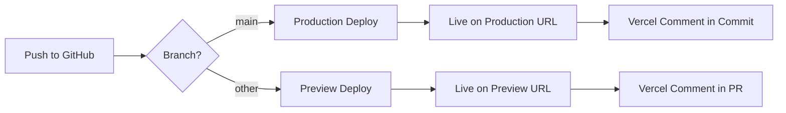

# 🚀 Автоматический деплой на Vercel

## Варианты настройки автодеплоя:

---

## 🔥 Вариант 1: Vercel GitHub Integration (РЕКОМЕНДУЕТСЯ)

**Это самый простой способ - Vercel автоматически деплоит при каждом push в GitHub!**

### Шаги:

1. **Откройте Vercel Dashboard:**
   https://vercel.com/dashboard

2. **Перейдите в проект:**
   https://vercel.com/waldfalkes-projects/fit-lead-test-assignment

3. **Settings → Git:**
   - Убедитесь, что репозиторий подключен: `waldfalke/fit-lead-test-assignment`
   - Включите "Automatic deployments from Git"

4. **Настройте ветки:**
   - **Production Branch:** `main` (каждый push → production deploy)
   - **Preview Branches:** все остальные (каждый push → preview deploy)

### ✅ Готово! Теперь:
- **Push в `main`** → автоматический production deploy
- **Push в другую ветку** → preview deploy с уникальным URL
- **Pull Request** → preview deploy с комментарием в PR

### Проверка:
```bash
# Сделайте любое изменение
echo "test" >> README.md

# Закоммитьте и запушьте
git add .
git commit -m "test: auto deploy"
git push origin main

# Vercel автоматически задеплоит!
# Проверьте: https://vercel.com/waldfalkes-projects/fit-lead-test-assignment/deployments
```

---

## 🔧 Вариант 2: GitHub Actions (для кастомного CI/CD)

Уже настроено в `.github/workflows/vercel-deploy.yml`

### Требуется настроить GitHub Secrets:

1. **Получите Vercel токены:**
   ```bash
   # 1. Vercel Token
   # https://vercel.com/account/tokens
   
   # 2. Vercel Org ID
   cat .vercel/project.json | grep orgId
   
   # 3. Vercel Project ID
   cat .vercel/project.json | grep projectId
   ```

2. **Добавьте secrets в GitHub:**
   - Откройте: https://github.com/waldfalke/fit-lead-test-assignment/settings/secrets/actions
   - Добавьте:
     - `VERCEL_TOKEN` - ваш Vercel token
     - `VERCEL_ORG_ID` - из .vercel/project.json
     - `VERCEL_PROJECT_ID` - из .vercel/project.json

3. **Готово!** Теперь при каждом push в `main`:
   - GitHub Actions запустится
   - Соберет проект
   - Задеплоит на Vercel

### Плюсы GitHub Actions:
- ✅ Полный контроль над CI/CD
- ✅ Можно добавить тесты, линтеры
- ✅ Кастомные шаги деплоя

---

## 📁 Конфигурация Vercel

Создан `vercel.json`:
```json
{
  "buildCommand": "npm run build",
  "framework": "nextjs",
  "git": {
    "deploymentEnabled": {
      "main": true
    }
  },
  "regions": ["fra1"]
}
```

---

## 🎯 Текущий статус:

### ✅ Что уже работает:
1. Проект залинкован с Vercel
2. Production URL активен
3. GitHub репозиторий подключен

### 🔄 Что нужно сделать:

#### Если используете Vercel Git Integration (Вариант 1):
- [x] Проект уже подключен к GitHub
- [ ] Убедитесь, что "Auto deployments" включены в Vercel Settings

#### Если используете GitHub Actions (Вариант 2):
- [x] Workflow файл создан
- [ ] Добавить secrets в GitHub
- [ ] Запушить изменения

---

## 🧪 Тестирование автодеплоя:

### После настройки:

1. **Сделайте тестовое изменение:**
   ```bash
   # Измените README
   echo "# Auto-deploy test" >> README.md
   
   # Закоммитьте
   git add .
   git commit -m "test: verify auto-deploy"
   
   # Запушьте
   git push origin main
   ```

2. **Проверьте деплой:**
   - **Vercel Dashboard:** https://vercel.com/waldfalkes-projects/fit-lead-test-assignment/deployments
   - **GitHub Actions:** https://github.com/waldfalke/fit-lead-test-assignment/actions (если используете Вариант 2)

3. **Проверьте live сайт:**
   - Production: https://fit-lead-test-assignment-d9m62c3ny-waldfalkes-projects.vercel.app
   - Или новый URL, если Vercel создаст alias

---

## 🌐 URLs после настройки:

### Production:
- **Main:** https://fit-lead-test-assignment.vercel.app
- **Custom:** https://fit-lead-test-assignment-d9m62c3ny-waldfalkes-projects.vercel.app

### Preview (для PR):
- Vercel автоматически создаст уникальный URL для каждого PR
- Пример: `fit-lead-test-assignment-git-feature-xyz.vercel.app`

---

## 📊 Workflow автодеплоя:



### Что происходит при push:
1. **Git push** → GitHub получает код
2. **Vercel webhook** → Vercel получает уведомление
3. **Build starts** → Vercel запускает `npm run build`
4. **Deploy** → Vercel деплоит на свои серверы
5. **Live** → Сайт доступен на URL
6. **Comment** → Vercel оставляет комментарий с URL (если PR)

---

## ⚙️ Переменные окружения:

### Если нужны env variables:

1. **В Vercel Dashboard:**
   - Settings → Environment Variables
   - Добавьте переменные для Production/Preview

2. **В vercel.json:**
   ```json
   {
     "env": {
       "NEXT_PUBLIC_SITE_URL": "https://fit-lead-test-assignment.vercel.app"
     }
   }
   ```

3. **В коде:**
   ```tsx
   const siteUrl = process.env.NEXT_PUBLIC_SITE_URL;
   ```

---

## 🚨 Troubleshooting:

### Деплой не запускается автоматически:
1. Проверьте Settings → Git в Vercel Dashboard
2. Убедитесь, что "Automatic deployments" включены
3. Проверьте, что репозиторий правильно подключен

### Build fails:
1. Проверьте логи в Vercel Dashboard → Deployments
2. Убедитесь, что `npm run build` работает локально
3. Проверьте переменные окружения

### GitHub Actions не запускаются:
1. Проверьте, что secrets добавлены
2. Проверьте syntax в `.github/workflows/vercel-deploy.yml`
3. Проверьте Actions tab в GitHub

---

## 📝 Рекомендации:

### Для Production:
- ✅ Используйте Vercel Git Integration (проще)
- ✅ Включите auto-deploy для `main` ветки
- ✅ Настройте preview для PR (код-ревью)

### Для Enterprise:
- ✅ Используйте GitHub Actions (больше контроля)
- ✅ Добавьте тесты перед деплоем
- ✅ Настройте approval для production

---

## ✅ Checklist активации автодеплоя:

### Vercel Git Integration (Вариант 1):
- [x] Проект создан на Vercel
- [x] GitHub репозиторий подключен
- [ ] Auto-deployments включены в Settings
- [ ] Push в main → проверить автодеплой

### GitHub Actions (Вариант 2):
- [x] Workflow файл создан
- [ ] VERCEL_TOKEN добавлен в GitHub Secrets
- [ ] VERCEL_ORG_ID добавлен в GitHub Secrets
- [ ] VERCEL_PROJECT_ID добавлен в GitHub Secrets
- [ ] Push в main → проверить Actions

---

**Рекомендация:** Используйте **Вариант 1** (Vercel Git Integration) - это проще и работает из коробки!

**Последнее обновление:** 2025-10-05T02:13:00Z
